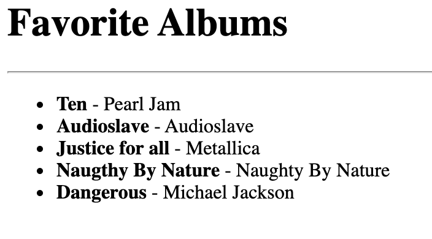

# EJS-FIRST-DEMO

A simple demo using `express@4.17.1`, `ejs@3.1.6`

## Run on dev mode with nodemon
```
npm install
npm install -D

npm run dev
```

## Run without nodemon
```npm server.js```

or...

```npm run start```

## Main file
```server.js```

## Credits
- [do-community/ejs-demo](https://github.com/do-community/ejs-demo)

## Result

